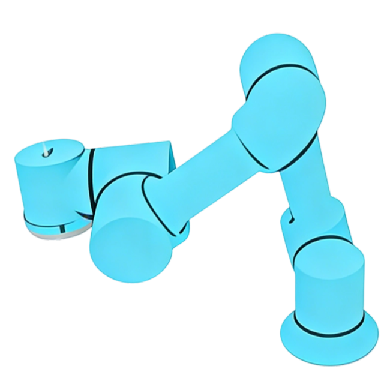
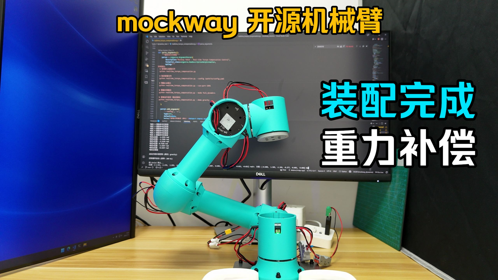
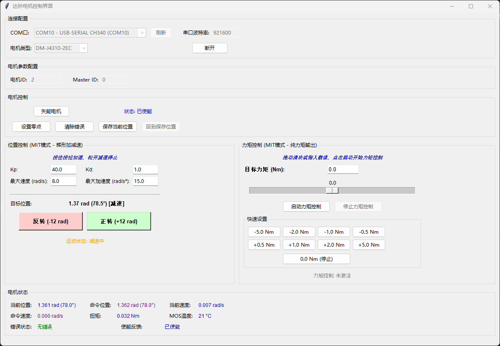
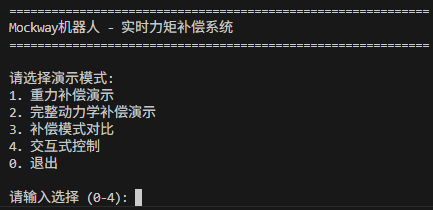
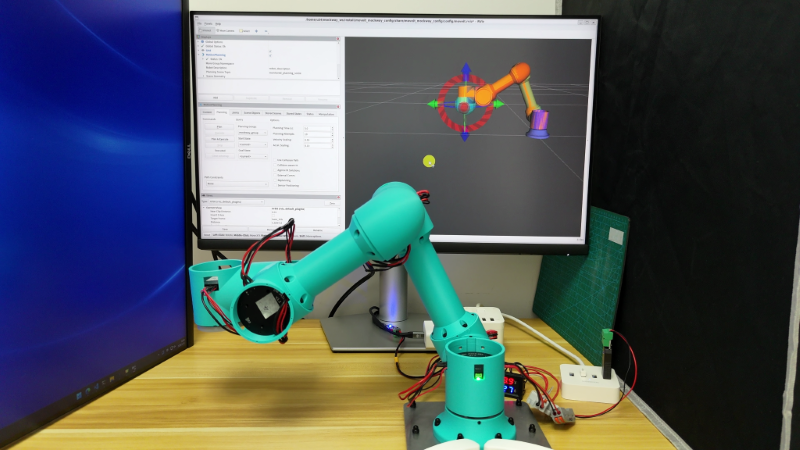
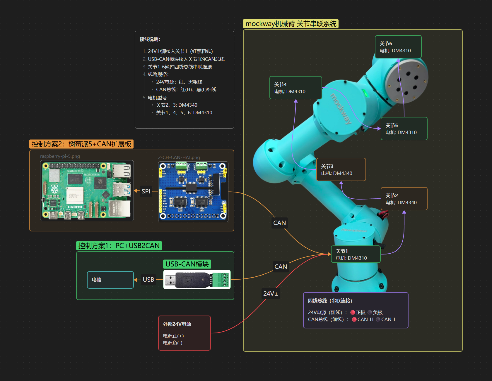

<div align="center">
  

  # 牧卫机器人

  开源六轴协作机械臂系统，包含机械结构、电路和软件
  
</div>


**中文 | [English](README_EN.md)**

[](https://www.bilibili.com/video/BV1AxrbBWEjN/)

> 视频中测试程序为`tools/dynamics_test/real/inverse_dynamics_test.py`脚本
> 
> 运行后选择：1-重力补偿模式
> 
> 根据实际情况配置`tools/dynamics_test/dynamics_test.yaml`中串口等信息

CAN设备使用[维特USB-CAN模块](https://detail.tmall.com/item.htm?id=598670674373&skuId=4483773298672)，串口波特率921600，CAN总线波特率1M

## ⚙️ 机械结构

使用`JellyCAD`参数化建模，模型参数在`/jellycad_src`目录下，软件下载地址：[JellyCAD v0.3.10](https://github.com/Jelatine/JellyCAD/releases/tag/v0.3.10)

结构件可3D打印，已上传到[MakerWorld](https://makerworld.com.cn/zh/models/2037149-mockway-kai-yuan-liu-zhou-xie-zuo-ji-jie-bi#profileId-2273199)

[](https://makerworld.com.cn/zh/models/2037149-mockway-kai-yuan-liu-zhou-xie-zuo-ji-jie-bi#profileId-2273199)

## 🚀 程序运行

### 🎮 电机调试

单个电机运动调试和关节零点标定的界面

```bash
python tools/motor_gui/motor_gui.py
```



### ⚡ 力矩补偿

```bash
python tools/dynamics_test/realtime_torque_compensation.py
```



> 运行前请阅读下面 `⚠️ 注意事项`

### 🦾 运行MoveIt!

建议运行环境：

- Ubuntu 24.04
- ROS2 Jazzy + MoveIt!

1. 创建工作空间

```bash
mkdir -p ~/mockway_ws/src
cd ~/mockway_ws/src
```

2. 克隆mockway_robotics仓库

```bash
git clone https://github.com/Jelatine/mockway_robotics.git
```

3. 编译工作空间

```bash
cd ~/mockway_ws
rosdep install --from-paths src/mockway_robotics/moveit_mockway_config/ --ignore-src -r -y
colcon build --symlink-install --packages-select moveit_mockway_config
```
4. 配置环境变量

```bash
source ~/mockway_ws/install/setup.bash
```

5. 启动程序

```bash
ros2 launch moveit_mockway_config demo.launch.py
```



### 🖥️ 完整程序

1. 安装`lua`

```bash
sudo apt install liblua5.4-dev
```

2. 构建`mockway_bringup`

```bash
cd ~/mockway_ws
rosdep install --from-paths src/mockway_robotics/ --ignore-src -r -y
colcon build --symlink-install --packages-select mockway_bringup
```
3. 启动程序

```bash
# 启动 move_group + servo ,仿真：use_mock_hardware:=true
ros2 launch mockway_bringup bringup.launch.py use_mock_hardware:=true
# 浏览器打开前端：http://localhost:8080/
```

## 📦 物料清单

详细的物料清单请查看：[BOM.md](doc/BOM.md)

复刻成本约4.2k（电机≈4k，打印件≈20，USB2CAN≈73，电源≈100，螺丝及工具<40）

## 🔌 电气连接



## ⚠️ 注意事项

**重要提示：力矩模式如果前期准备没做好容易发生飞车（失控）现象，请务必按照以下步骤操作。**

### 1. 结构匹配

确保机械结构与URDF模型一致。GitHub仓库最新版本已包含所有必需的结构件。

### 2. 关节零点标定

使用电机调试界面标定各关节零点位置，零点姿态需参考URDF定义。

```bash
python tools/motor_gui/motor_gui.py
```


### 3. 力矩值验证

在代码中注释掉`controller.enable_motors()`，先运行程序观察计算的力矩值是否正常。有条件的话，建议先运行一次位置模式，对比实际力矩与算法计算力矩的差异是否较小。

### 4. 重力补偿测试

初次测试时：
- 使用模式1（重力补偿模式）进行测试
- 增加电机阻尼参数：设置`mit_params.kd = 1`

### 5. 结构件打印

3D打印结构件时注意：
- 提高填充百分比（建议≥40%）
- 使用螺旋体（Gyroid）填充图案，以提高强度和减轻重量
