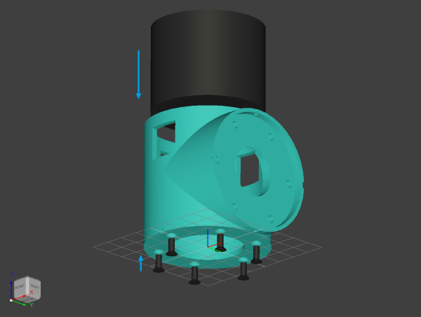

# 组装指南

## 1 嵌入所有热熔螺母

工具：`电烙铁`

### M2

材料：`flange.lua`结构件 5个、`土八热熔螺母M2*3*3` 10个

### M3

材料：`shell.lua`结构件 6个、`tail.lua`结构件 1个、`base.lua`结构件 1个、`elbow.lua`结构件 1个、`土八热熔螺母M3*4*4` 60个

|  |  |  |  |
|:---:|:---:|:---:|:---:|
| shell | tail | base | elbow |

## 2 安装所有电机到shell

材料：`shell.lua`结构件 6个、DM4310电机 4个、DM4340电机 2个、`沉头十字螺丝M3*8` 36个

工具：`十字螺丝刀`

## 3 安装所有法兰到电机转子

材料：装完电机的shell 6个、`flange.lua`结构件 5个、`tail.lua`结构件 1个、`沉头十字螺丝M3*12` 36个

## 4 安装关节1到基座

材料：`base.lua`结构件 1个、DM4310关节 1个、`外六角螺丝M3*8` 6个、`十字平头螺丝M2*6` 2个

工具：`开口扳手5.5mm`、`十字螺丝刀`

1. 将`外六角螺丝M3*8`转入小部分到`base.lua`结构件的热熔螺母上
2. 法兰两侧的M2热熔螺母对准基座的M2通孔，沿圆弧槽转到法看大孔对准外六角螺丝头
3. 所有头都穿过关节法兰后，将螺丝转入法兰圆弧槽内
4. 将两个`十字平头螺丝M2*6`穿过基座M2通孔，固定在关节上
5. 使用`开口扳手5.5mm`将螺丝固定在基座上

## 5 组装上臂

材料：DM4340关节(J2 J3) 2个、`linkage.lua`(长) 1个、`内六角螺丝钉M3*10` 12个、`X30(2+2)线` 2个、导线若干、焊锡、热缩管或电工胶布

工具：`电烙铁`、`内六角扳手`

1. 将`X30(2+2)线`插入关节2后，将导线通过电机上方剩余的导线孔穿入shell内
2. 关节3同上
3. 将4条延长线插入`linkage.lua`(长)结构件的导线孔内
4. 将延长线的两端分别通过关节2和关节3的法兰槽通孔穿入shell内，到电机顶部
5. 焊接所有导线
6. 使用`内六角螺丝钉M3*10`分别将关节2和关节3固定到`linkage.lua`(长)结构件，注意两关节轴要同向

## 6 安装上臂到关节1

材料：当前本体 1个、上臂 1个、`外六角螺丝M3*8` 6个、`十字平头螺丝M2*6` 2个

工具：`开口扳手5.5mm`、`十字螺丝刀`

将关节2安装到关节1上，步骤与关节1安装到底座相同

注意：关节1底部的M2螺丝难安装，此时安装顶部的即可

## 7 组装前臂

材料：DM4310关节(J4) 1个、`elbow.lua` 1个、`linkage.lua`(短) 1个、`内六角螺丝钉M3*10` 12个、`X30(2+2)线` 2个、导线若干、焊锡、热缩管或电工胶布

工具：`电烙铁`、`内六角扳手`

1. 将`X30(2+2)线`插入关节4后，将导线通过电机上方剩余的导线孔穿入shell内
2. 将4条延长线插入`linkage.lua`(短)结构件的导线孔内
3. 将延长线的一端分别通过关节4的法兰槽通孔穿入shell内，到电机顶部，另一端通过`elbow.lua`结构件的侧边方形孔穿出
4. 焊接所有导线
5. 使用`内六角螺丝钉M3*10`分别将关节4和`elbow.lua`结构件固定到`linkage.lua`(短)结构件，注意两个轴向

## 8 安装前臂到关节3

材料：当前本体 1个、前臂 1个、`外六角螺丝M3*8` 6个、`十字平头螺丝M2*6` 2个

工具：`开口扳手5.5mm`、`十字螺丝刀`

将`elbow`安装到关节3上，步骤与关节1安装到底座相同

## 9 安装关节5和关节6

材料：当前本体 1个、DM4310关节(J5 J6) 2个、`外六角螺丝M3*8` 12个、`十字平头螺丝M2*6` 4个

工具：`开口扳手5.5mm`、`十字螺丝刀`

1. 将关节5安装到关节4上，步骤与关节1安装到底座相同
2. 将关节6安装到关节5上，步骤与关节1安装到底座相同
